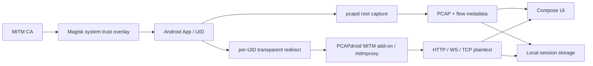

# Net Tools

Net Tools is a root-first Android network inspection console. It combines per-app packet capture, protocol inspection, TLS plaintext interception, certificate lifecycle management, and locally persisted evidence in one Compose application.

The current implementation targets rooted Android devices with Magisk. A non-root `VpnService` backend remains an extension point and is not part of the current acceptance scope.

## Product areas

- **Overview** — root, capture, decryption, and certificate readiness at a glance.
- **Traffic** — whole-device or per-app raw capture, PCAP persistence, and protocol/flow inspection.
- **Decrypt** — per-app transparent TLS interception, HTTP/WebSocket/TCP plaintext events, QUIC fallback, and persisted session history.
- **Settings** — certificate manager, MITM runtime, diagnostics, maintenance, and open-source attribution.



## Implemented capture stack

### Raw capture

- Per-app root capture uses the official PCAPdroid `pcapd` binary and its UID filter.
- Whole-device capture uses the device `tcpdump` binary.
- A small native root-side bridge receives `pcapd` packets over a Unix socket and writes standard PCAP files.
- The local parser currently identifies DNS, TCP, UDP, TLS/SNI, QUIC/UDP, HTTP, and ICMP flows.

### TLS decryption

- Net Tools manages the independent official **PCAPdroid MITM add-on** rather than embedding Python/mitmproxy into the main APK.
- The add-on CA is requested through its Binder/Messenger API and imported into Net Tools.
- Rooted devices can stage that CA into Android system trust through a reversible Magisk module overlay.
- Selected-app TCP is transparently redirected to the local mitmproxy runtime.
- Optional UDP/443 blocking is scoped to the selected UID to encourage HTTP/3/QUIC clients to retry over TCP/TLS.
- Decrypted events are streamed back through a `ParcelFileDescriptor` socket and stored as request/response/message payloads.
- Common secret-bearing headers and query parameters are redacted from UI previews and JSONL metadata.

System trust is not equivalent to universal certificate-pinning bypass. Apps with certificate pinning, private trust stores, or unusual native TLS stacks may still report interception errors; raw capture remains available in those cases.

## Data layout on device

Under Android external app data:

```text
Android/data/com.arthur.nettools/files/
├── captures/
│   ├── <session>.pcap
│   ├── <session>.json
│   └── <session>.log
├── intercepts/
│   └── <session>-<package>/
│       ├── session.json
│       ├── events.jsonl
│       └── payloads/
│           └── <event>-<kind>.bin
├── certificates/
│   └── nettools-ca.pem
└── addons/
    └── PCAPdroid-mitm-*.apk
```

The project-side evidence generated during development is under `artifacts/` and is intentionally Git-ignored because packet captures and decrypted payloads may contain private data.

## Build

Prerequisites on the development Mac:

- Android SDK / platform tools
- Android NDK and CMake
- JDK compatible with the configured Android Gradle Plugin
- `references/pcapd-bin` present locally; `references/` is intentionally ignored

On a clean checkout, recreate the ignored pinned references with:

```bash
./scripts/bootstrap-references.sh
```

Build and test:

```bash
./gradlew :app:testDebugUnitTest :app:assembleDebug
```

Debug APK:

```text
app/build/outputs/apk/debug/app-debug.apk
```

## Device-side TLS setup

1. Open **Decrypt**.
2. Install the official MITM add-on from the readiness card.
3. Import the CA generated by that add-on.
4. Stage the CA into system trust with the Magisk action.
5. Reboot once so the Magisk overlay becomes active.
6. Choose a target application and start TLS decryption.
7. Keep **Force QUIC → TCP fallback** enabled for apps which prefer HTTP/3.

Before every decryption session, Net Tools re-reads the live add-on CA and verifies that its SHA-256 fingerprint still matches the CA currently trusted by Android. If the add-on rotates its CA, Net Tools refuses interception and asks for a trust refresh instead of silently breaking TLS.

## Evidence and review

- Raw-capture validation report: `artifacts/validation/REPORT.md`
- Machine-readable raw summary: `artifacts/validation/summary.json`
- Runtime/add-on artifacts: `artifacts/runtime/`
- Decryption acceptance artifacts: `artifacts/decryption/`
- Product UI screenshots: `artifacts/product-review/`

See [`docs/validation.md`](docs/validation.md) for the acceptance ledger and [`docs/architecture.md`](docs/architecture.md) for the component/trust model.

## Automation helpers

```bash
# Pull capture, interception, and certificate evidence from a connected device.
./scripts/pull-device-data.sh f27e2c0f

# Build a privacy-safe summary from pulled interception sessions.
python3 scripts/summarize-intercepts.py artifacts/device-export/latest/intercepts
```

## Upstream references

The following projects are kept as local research/build references under the ignored `references/` directory:

- PCAPdroid / pcapd
- PCAPdroid MITM add-on
- mitmproxy
- HTTP Toolkit Frida interception/unpinning scripts

The independent MITM add-on remains a separate package with its own GPL-3.0 distribution terms. Net Tools does not copy its GPL Python runtime into the main application APK.
