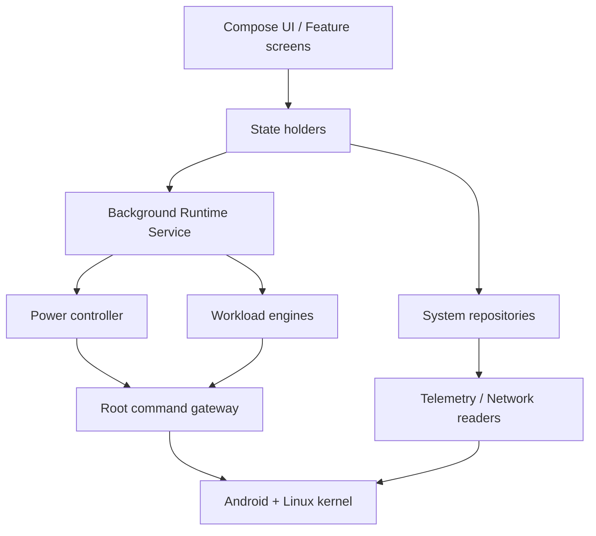
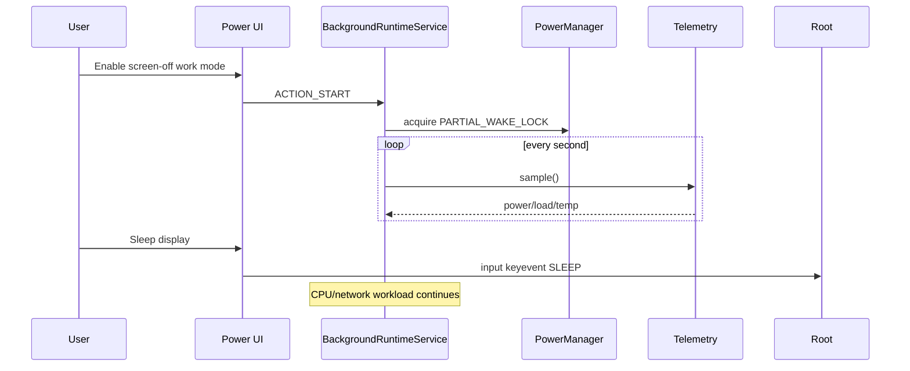

# Background Server architecture

## Product role

Background Server is a local control plane for a rooted Android device. The UI configures and observes long-running workloads; privileged operations stay behind a root capability boundary instead of being embedded in Composables or individual features.



## Package boundaries for phase 1

- `ui.*`: rendering and user events only.
- `domain.*`: immutable state and feature contracts.
- `platform.root`: the only package allowed to invoke `su`.
- `platform.power`: display/wake configuration and power telemetry.
- `platform.network`: interface/IP discovery.
- `engine.wireguard`: WireGuard userspace tunnel configuration and runtime state.
- `runtime`: foreground lifecycle, wake lock ownership and workload supervision.

All long-running workload implementations conform to the small `BackgroundEngine` contract and are registered with `EngineSupervisor`. WireGuard is the first engine; future OpenVPN, HTTP/SOCKS, capture and automation engines should enter through the same supervisor instead of adding feature-specific daemon ownership to the UI.

These are kept as explicit package boundaries in the first milestone. Once the second independent workload engine lands, they should be extracted into Gradle modules (`core-root`, `core-runtime`, `feature-power`, `feature-network`, `engine-*`) without changing their public contracts.

## Runtime ownership rule

The UI never owns a long-running lock or daemon. It sends an intent to `BackgroundRuntimeService`. The service owns the Android partial wake lock and periodically publishes runtime metrics. This avoids leaving a kernel wake lock behind when the UI process lifecycle changes.



## Root policy

Root is a capability, not an architectural layer leak. Every privileged command returns a typed result containing exit code/stdout/stderr. Future engines must request capabilities from a root gateway rather than constructing arbitrary `su` calls in UI code.

Planned hardening:

1. Move from one-shot `su -c` calls to a persistent privileged companion process.
2. Use a command allow-list/API instead of arbitrary shell strings.
3. Add engine health checks and automatic restart policy.
4. Add boot restoration only after the user explicitly enables it.

## Networking model

Two networking roles must stay separate:

1. **Device VPN client**: Android `VpnService` routes this phone's traffic through a tunnel.
2. **Background proxy/VPN server**: remote devices connect *to this phone*. This requires a listening server engine plus routing/NAT, and should not be modeled as merely a `VpnService` screen.

The planned server engine API is:

```text
TunnelEngine
  prepare(config)
  start()
  stop()
  health()
  endpoints()
  trafficStats()
```

WireGuard now has the first end-to-end implementation using the official Android userspace backend plus root routing/NAT. OpenVPN remains the second protocol candidate. LAN validation comes before public-Internet exposure.

On Android 17 / target SDK 37, direct LAN traffic (including accepting inbound TCP/UDP connections) is gated by `ACCESS_LOCAL_NETWORK`. The network page owns the user-facing runtime permission flow; engines receive only a resolved capability state.
