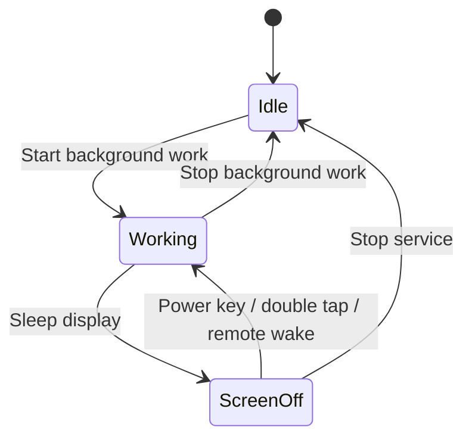

# Power management feature

## Goals

- Physically turn the display off while background work stays alive.
- Preserve normal wake paths (power key and device-supported gestures such as double tap).
- Make the lock owner explicit and observable.
- Show enough telemetry to understand whether a background workload is healthy and expensive.

## Current control model

`BackgroundRuntimeService` holds an Android `PARTIAL_WAKE_LOCK`. Display sleep/wake and secure wake settings use the root gateway.

## Metrics

Phase 1 reports:

- runtime duration;
- battery-side instantaneous power estimate using Android `BatteryManager` current plus framework battery voltage, avoiding a root shell process for every sample;
- accumulated energy estimate while the runtime service is active;
- normalized 1-minute system load;
- thermal reading when an accessible thermal zone exists;
- display interactive state.

Battery framework values are not a calibrated wall-power meter. When the phone is charging or bypass-powered, battery-side current can significantly under-report total device consumption. The UI therefore labels these numbers as estimates. Root-only battery sysfs is intentionally not polled every second because repeatedly spawning `su` would distort the workload being measured.

## Screen wake settings

The first supported device setting is `secure.double_tap_to_wake`. Device/OEM-specific wake gestures must be represented as capabilities so unsupported settings can be hidden instead of silently failing.

### Standard screen off vs no-lock screen off

The current Redmi/MIUI stack has a secure keyguard, so maximum display power saving and instant return to the current page are exposed as two separate modes instead of trying to weaken the configured credential.

**Standard screen off** uses the Android sleep path. The physical display reaches `ScreenState=OFF`, which is the lower-power choice, but Android/MIUI may show Keyguard on wake.

**No-lock screen off** deliberately keeps Android logically `Awake`. Background Server draws an opaque black surface over the current page, overrides the app-window brightness to `0`, hides system bars, and temporarily holds `FLAG_KEEP_SCREEN_ON`. A physical double tap on the black surface restores the exact existing Activity/Compose page. Pausing/leaving the Activity automatically cancels the blank state and restores normal brightness as a safety fallback.

No-lock screen off consumes more power than a real `ScreenState=OFF` because the display/touch pipeline remains logically active. It is intended for interactive testing and unattended dashboards where immediate return to the current page matters more than absolute minimum power.
