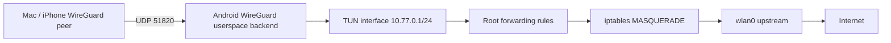
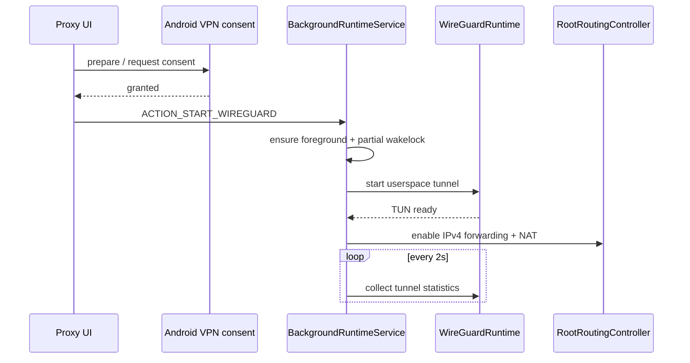

# WireGuard server design

## Goal

The phone is the VPN endpoint, not merely a client consuming another VPN. A peer on the LAN (and later over the Internet) connects to the phone, and packets may be forwarded through the phone's upstream network.



## Backend selection

The current Redmi test device exposes `/dev/net/tun` and legacy iptables, but does not expose a WireGuard kernel module and does not ship `wg` tooling. Therefore the first implementation uses the official embeddable Android `com.wireguard.android:tunnel` userspace backend.

The capability layer keeps the distinction explicit:

```text
kernel WireGuard + wg tools -> future Kernel/wg-quick backend
TUN available              -> official userspace GoBackend
no TUN                      -> unsupported
```

The UI shows this probe instead of pretending every rooted ROM has the same networking stack.

## Runtime ownership

The `AppViewModel` does not own the WireGuard process. It only requests actions from `BackgroundRuntimeService`.



This keeps the tunnel alive when the activity is closed and gives system restart handling one owner.

## Initial LAN test profile

- Server: `10.77.0.1/24`
- Test peer: `10.77.0.2/32`
- UDP listen port: `51820`
- Upstream: `wlan0`
- Peer `AllowedIPs`: `0.0.0.0/0` on the generated client profile
- NAT source subnet: `10.77.0.0/24`

One generated test peer is intentionally used for the first vertical slice. Multi-peer CRUD, QR export, peer revocation and per-peer traffic/handshake state belong to the next iteration.

## Root rules

Rules are idempotent on start (`iptables -C ... || iptables -A ...`) and explicitly removed on stop. The app does not flush Android's existing firewall tables.

```text
net.ipv4.ip_forward = 1
FORWARD: tunnel -> wlan0 ACCEPT
FORWARD: wlan0 -> tunnel RELATED,ESTABLISHED ACCEPT
NAT POSTROUTING: 10.77.0.0/24 -> wlan0 MASQUERADE
```

IPv4 forwarding is not force-disabled on stop because it is a process-global kernel setting that another rooted workload may also depend on. The rules owned by this engine are removed; a later privileged companion should add reference-counted sysctl ownership.

## Remote deployment after LAN validation

LAN success is only the first gate. Remote use from Malaysia additionally needs a reachable home endpoint. The next diagnostic layer should distinguish:

1. router port forwarding available;
2. public IPv4 vs CGNAT;
3. dynamic public IP and DDNS needs;
4. IPv6 reachability;
5. fallback overlay/relay when direct inbound connectivity is impossible.
