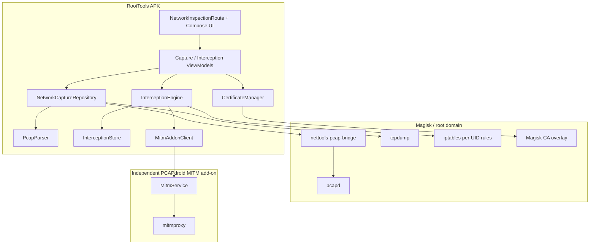
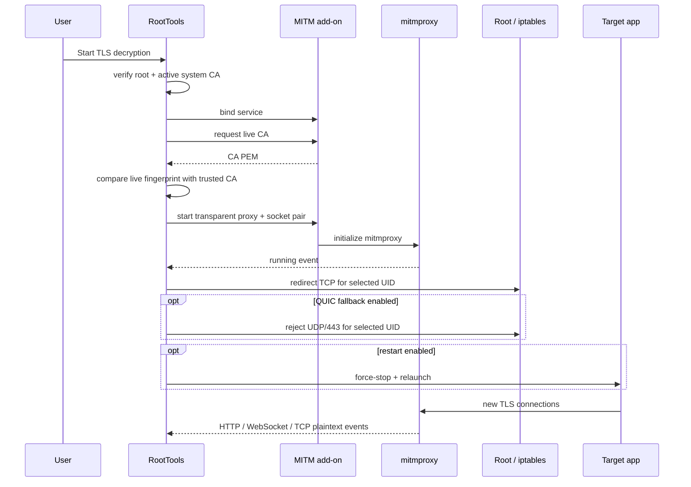

# RootTools Network Inspection Architecture

> 本文最初来自独立 Net Tools 工程，现描述 `:app` 内的 Network Inspection 域。旧的 `MainActivity` / `MainViewModel` 已由 RootTools navigation route 与专用 ViewModel 取代；所有 Root 操作复用共享 `RootShell` 和审计边界。

## 1. Scope

RootTools Network Inspection 提供两个彼此独立的观测产品：

1. **Raw network evidence** — PCAP and transport/protocol metadata, available even when TLS cannot be decrypted.
2. **Decrypted semantic evidence** — HTTP/WebSocket/TCP plaintext emitted by a local MITM runtime when the target application accepts the interception trust chain.

The split is architectural, not cosmetic. A failed MITM session must never make the product blind to network traffic.

The detailed product interaction and protocol-aware packet presentation contract lives in [`packet-inspection-ux.md`](packet-inspection-ux.md).

## 2. Implemented component map



## 3. Raw capture

### Per-app mode

`pcapd` is used because it can resolve packets to Android UIDs and filter by UID before packets reach the app. The prebuilt daemon is packaged as `libpcapd.so` so Android can unpack it into the app native-library directory.

On the tested MIUI/Magisk device, the Magisk root SELinux context cannot traverse the application-private data directory. Therefore the production flow uses a **root-side bridge**:

1. Copy `pcapd` and the small bridge binary into `/data/local/tmp`.
2. Create the Unix socket and PCAP writer in that root-accessible directory.
3. Run `pcapd -u <target uid>`.
4. Convert `pcapd_hdr_t + packet` messages into a standard PCAP file.
5. Move/copy the completed PCAP into external app storage where the Android process can parse and display it.

This avoids pretending that a whole-device tcpdump is app-specific.

### Whole-device mode

Whole-device capture uses `tcpdump -i any -s 0`. This mode is explicitly labelled as whole-device capture in the UI.

## 4. Protocol parsing

`PcapParser` is a lightweight local parser for product UI. It currently handles:

- Ethernet / Linux cooked / raw-IP link types used by the capture backends
- IPv4 / IPv6
- TCP / UDP / ICMP
- DNS question names
- cleartext HTTP request/status start lines
- TLS ClientHello SNI when present in a non-fragmented record
- QUIC/UDP classification for UDP/443

The parser is intentionally not positioned as a Wireshark replacement. Raw PCAP remains the source of truth for deeper offline analysis.

## 5. TLS interception

### Independent MITM runtime

Embedding Python and mitmproxy into the main APK would increase size, startup cost, and failure blast radius. RootTools therefore communicates with the official PCAPdroid MITM add-on through its Messenger contract.

The main app owns:

- target package/UID selection
- readiness and lifecycle UX
- certificate trust state
- transparent redirection rules
- plaintext stream parsing/persistence
- history and diagnostics

The independent add-on owns:

- Python runtime
- mitmproxy lifecycle
- dynamic leaf-certificate generation
- HTTP/1.1 / HTTP/2 / WebSocket decoding

### Startup sequence



The engine waits for the add-on `running` event **before** changing iptables. This prevents target traffic from being redirected into a proxy that is not ready.

## 6. Certificate lifecycle

The built-in MITM flow can import the CA generated by the add-on or generate a standalone RootTools CA. Only the selected CA is staged into the reversible Magisk trust overlay.

Certificate state is represented as three distinct facts:

- certificate available in RootTools
- Magisk system-trust module staged
- certificate visible in the currently active Android system trust store

The UI does not collapse these into one “installed” boolean. A staged module that has not yet survived a reboot is displayed as **reboot required**.

System CA files are PEM-formatted and named using the OpenSSL-compatible `subject_hash_old` convention expected by Android trust stores.

## 7. QUIC / HTTP3 fallback

Apps such as YouTube and Google clients may strongly prefer UDP/443. In a decrypt session, the optional compatibility profile installs a UID-scoped output rule rejecting UDP/443. The intent is to encourage the selected app to retry over TCP/TLS, which the transparent mitmproxy path can inspect.

The rule is:

- not used in ordinary raw-capture sessions
- explicit and visible in the decryption workspace
- scoped to one UID
- removed on stop, error recovery, and app initialization

## 8. Plaintext data model and privacy

The MITM add-on sends a framing header followed by payload bytes. RootTools maps these to `DecryptedEvent` values such as:

- HTTP request / response
- WebSocket client / server message
- TCP client / server message
- TLS / HTTP / TCP error
- runtime log

Each decryption session persists:

```text
session.json      summary and counters
events.jsonl      normalized/redacted metadata
payloads/*.bin    raw payloads when full-payload storage is enabled
```

Preview redaction covers common authentication headers and common token-bearing query parameters. This **does not sanitize raw payload files**. Full-payload storage therefore has an explicit sensitive-data warning in the UI.

## 9. Navigation and interaction model

The UI uses Jetpack Compose, Material 3, and Navigation 3 `NavDisplay`.

Top-level destinations:

- **Overview** — system readiness and shortcuts
- **Traffic** — raw capture and PCAP sessions
- **Decrypt** — readiness, compatibility profile, live plaintext, and history
- **Settings** — certificates, runtime, diagnostics, and attribution

Nested routes are full pages rather than modal diagnostic dialogs:

- raw capture session detail
- decrypted payload detail
- persisted decryption session detail
- certificate manager
- diagnostics
- about/licenses

## 10. Persistence

Raw sessions and decryption sessions are filesystem-first so captures can be pulled over ADB without a database migration dependency.

Metadata is compact JSON/JSONL and large binary data is kept separately. This keeps future migration to Room indexes straightforward without changing artifact formats.

## 11. Security and failure model

1. Root is required for the current capture/interception backends.
2. System CA injection is reversible and implemented as a Magisk overlay, not a physical `/system` rewrite.
3. Transparent redirection is scoped to the user-selected UID.
4. Stale iptables chains are cleaned on app initialization and session stop.
5. The live CA fingerprint is rechecked against the trusted CA before each interception session.
6. Socket closure during normal stop is treated as lifecycle, not an application crash.
7. Pinning/custom trust-store failures are surfaced as errors rather than hidden.
8. UI/metadata previews redact common credentials; optional raw payload files remain sensitive evidence.

## 12. Deliberate extension points

The following are **not** represented as completed capabilities in the current UI:

- non-root `VpnService` capture backend
- Frida/LSPosed pinning profiles
- protobuf/gRPC schema-aware decoding
- PCAPNG/HAR export pipeline
- localhost/MCP query service

The existing data model and capture/interception separation are designed so these can be added without replacing the UI contract or stored-session formats.

## 13. Reference implementations

Local ignored references:

- PCAPdroid — pcapd, root-capture architecture, and application attribution
- PCAPdroid MITM — independent mitmproxy Android runtime and wire protocol
- mitmproxy — TLS/HTTP interception engine
- HTTP Toolkit Frida interception/unpinning scripts — future instrumentation reference

The pinned `pcapd` binary and native bridge are built into the canonical `:app`; source provenance and hashes are documented under `docs/third-party/`.
